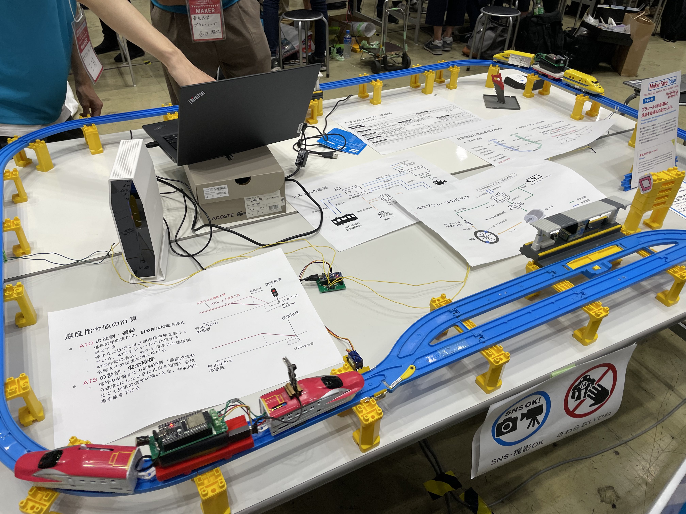
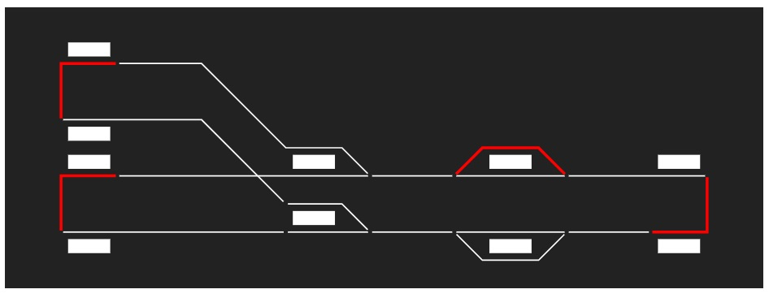

# 自動運転

今年度の大きな新たな取り組みの1つが列車の自動運転です。

色々な方法があるので非常に悩んだ部分です。計画当初は、列車の位置をホールセンサを用いて把握して、その位置に基づいてポイントを切り替えるようなシステムを想定しており、ポイントと列車の状態の管理に悩んででいました。

そんな中、Maker Fair Tokyoに訪れた際に「[東京大学プラレーラーズ](https://plarailers.com/)」さんという団体がまさにプラレールの自動運転を行なっていたので色々とお話を伺っていたところ、コラボのお誘いを受け調布祭でのコラボが実現しました。

調整を行ったところ現在工研が開発しているシステムと組み合わせることが可能と言うことがわかり、プラレーラーズさんが実装した自動運転システムをauto operationとして組み込みました。

## 自動運転の仕組みについて

システムの詳細に関しては、プラレーラーズさんの資料やコードを参考にしていただきたいですが簡単に...。

自動運転システムでは、配線図に示している`chofu_b5`のようなストップレールとホールセンサからなる閉塞区間によって列車の位置を管理しています。プラレーラーズさんによるシミュレーションの画面のような感じです。列車ごとにダイヤを設定しており、それの列車の位置に応じてポイントとストップレールの切り替えを行っているようです。

プラレーラーズさん側のシステムと工研のシステムでは扱っている情報や処理が異なるのですが、インターフェース部分や内部での値の取り扱いを工夫することによって連携を行っています。

ホールセンサは、プラレールの車両の底の部分に取り付けられたネオジウム磁石の磁気を検知するセンサです。このセンサを用いることによって、列車がセンサを通過したことを検知しています。検知したということを、jsonフォーマットのhttp経由でjson2grpcに送信してサーバーでgRPCに変換してauto operationに通知を行うようになっています。