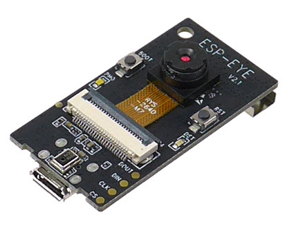

# カメラ配信

## 車載カメラ配信

ESP-EYE（図¥ref{fig:eye}）というマイコンボードを一部のラジコン化したプラレールの先頭に取り付けており、車両からの映像を見れるように実装を行いました。ESP-EYEは、小さいながら単体でWi-Fi接続できてWebカメラとして利用することができる便利なボードです。

今回はプログラムとして[esp32-cam-mjpeg](https://github.com/arkhipenko/esp32-cam-mjpeg)を利用したのですが、これはESP-CAM側でストリーミングサーバーを建ててそこにアクセスするとmjpeg形式で動画がストリーミングされるというものです。そのため、単体ではWebRTCに直接配信できないので、canvasに描画されたmjpegをcaptureしてstreamを生成して、そのstreamをSkyWayに配信する配信用のサイトを構築して配信を行いました。これにより、ESP-CAMに接続されるクライアントが1つに限定されることでESP-CAMへの負荷も軽減されています。

## Webカメラ配信

会場内の各所に設置されたWebカメラから各駅の現状を配信するために、SkyWayを用いて配信サイトを構築しています。仕組み自体は単純で、会場内にWebカメラとノートパソコンを設置しておき、配信用のサイトから駅ごとに固定のRoomIdで入室してカメラ映像の配信を行っています。