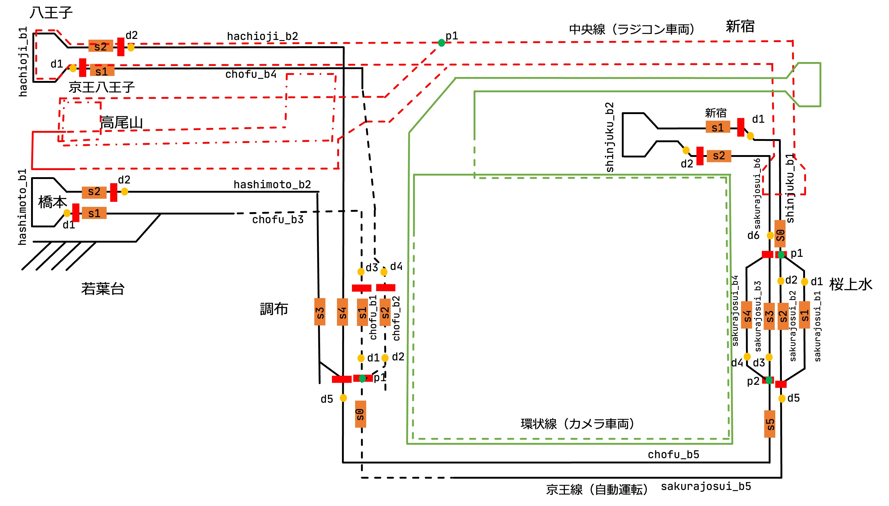
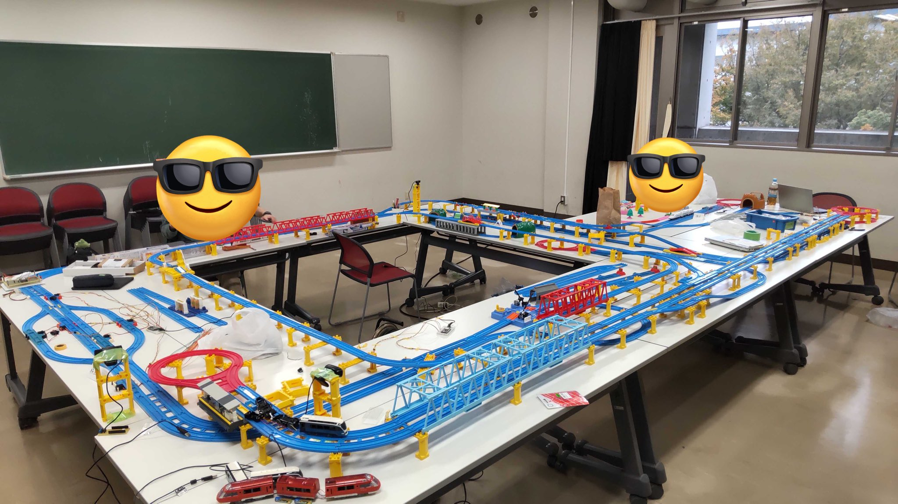

# レイアウト

今年度のレイアウトを以下に示します。今年度は教室の関係で、昨年度よりも少し狭いレイアウトになりましたが、スペースを上手く活かして京王線を再現しました。

いくつか路線がありますが京王線がシステムによる遠隔制御路線で、そのほかの中央線や環状線はラジコンが走る専用路線を担っておりポイントやストップレールの制御は行なっていません。

桜上水に待避線を用意して通過待ちを可能にしたり、調布駅を立体交差化したりと工夫しています。新宿駅のホームがなんで2つなんだ！というツッコミもあるかと思いますが、そこはバーチャル京王線ということで...。

昨年度の反省(昨年は岩本町駅のように1つのホームに両方向の列車が来るようなパターンが存在していたためポイントの状態管理で組合せ爆発したり、列車が正面衝突する事故が多発しました...)を生かして、ソフトウェア設計が難しくならないように物理的に調整したレイアウトになっており、列車が必ず一方通行に流れるように工夫しています。

プラレールに関しては、鉄道研究会から貸していただきプラレールの車両に関してはラジコン車両は主に工研で用意しました。
