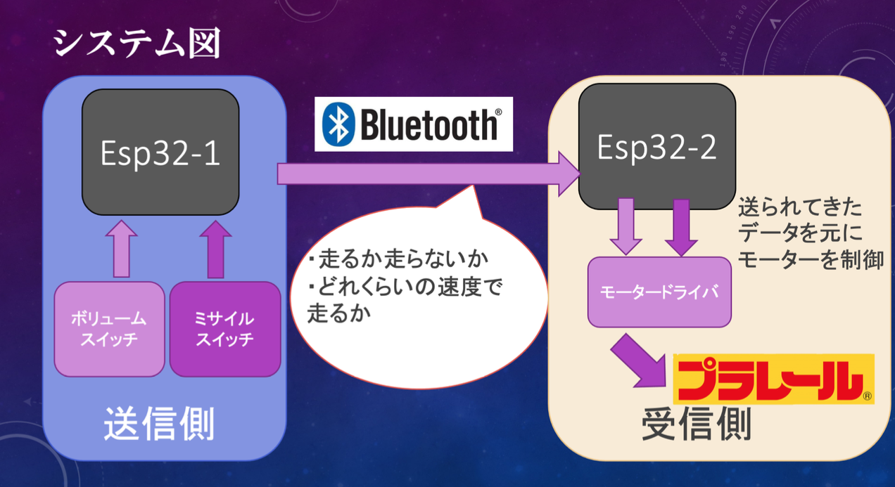
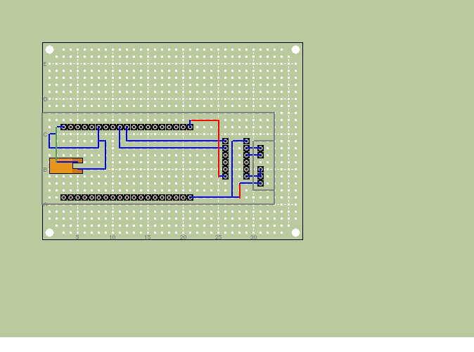
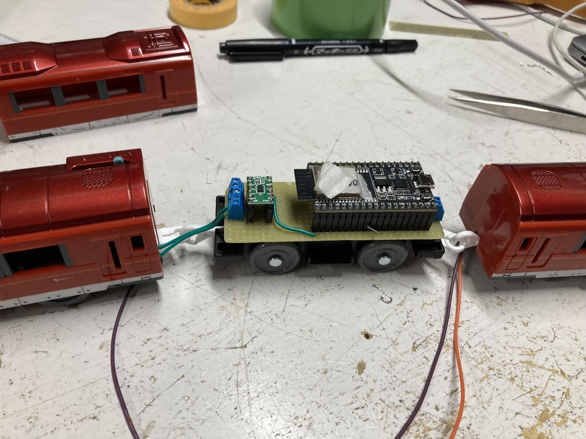
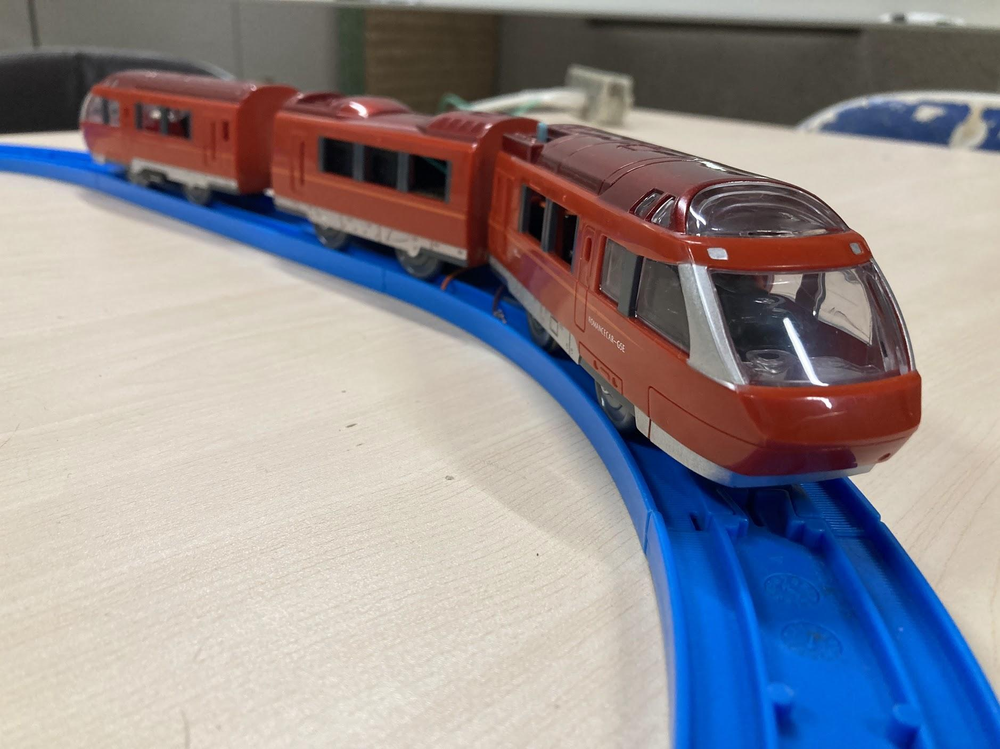

# プラレールラジコン化計画

## プラレールって？
プラレールとは古来より男児たちを中心に遊ばれている電車の形状をした玩具である。JR、私鉄を含む
豊富な車両があり、果てにはモノレールのプラレールも存在する。そんな男児なら一度は触ったことがあるであろうプラレール、その構造は実にシンプルなものだ。
電源を入れたらモーターが回転し電車がただ走り出すというものだ。端的にいえば前に走るだけであり、その動作は本来制御不能。しかし今回科学の力を用いてプラレールの速度制御を遠隔で行い、ラジコン化させる。

## 製作における要件定義
今回ラジコンプラレールの製作に当たって以下三つの要件を定めて開発を行った。

- 実機コントロールを用いて無線でプラレールをスムーズにリアルタイムで速度制御する。
- 改造の際、プラレールの外見を損なわないように部品を内部に収める。
- 量産しやすいようシンプルな構造にする。

そのため最終的にはラジコンプラレールを量産、調布祭で展示及びユーザーによる運転ができるようにする予定である。

ラジコンプラレールの大まかなシステムは以下の通りである。主にコントロールを担う送信側と、送られてきた
値を元にモーターを制御する受信側に分けられる。間の通信にはBluetoothを用いる。これによりある程度遠くから
運転を行うことが可能になり、消費電力も抑えることができる。

## ハードウェア
### 使用部品

- タカラトミー TAKARATOMY S52 [プラレール 小田急ロマンスカーGSE70000形]  
- ＥＳＰ３２－ＤｅｖＫｉｔＣ　ＥＳＰ－ＷＲＯＯＭ－３２開発ボード×2
-  DＤＲＶ８８３５使用ステッピング＆ＤＣモータドライバモジュール | ＤＲＶ８８３５使用ステッピング＆ＤＣモータドライバモジュール
-  ターミナルブロック　２．５４ｍｍ　２Ｐ　青　縦 | ターミナルブロック　２．５４ｍｍ　２Ｐ　青　縦
-  ピ分割ロングピンソケット　１×４２　（４２Ｐ） | 分割ロングピンソケット　１×４２　（４２Ｐ）
-  ＸＨコネクタ　ベース付ポスト　サイド型　２Ｐ　Ｓ２Ｂ－ＸＨ－Ａ（ＬＦ）（ＳＮ）
-  リチウム電池　ＣＲ１２３Ａ（ＣＲ１２３）
-  ００６Ｐアルカリ電池（積層電池）　９Ｖ　ゴールデンパワー
-  ミサイルスイッチ
-  ボリューム抵抗10k$¥Omega$
-  フルカラーLED

今回は以上の部品を用いてプラレールのラジコンを行った。使用プラレールは小田急ロマンスカーGSE。箱根湯本へ向かう小田急を代表する特急であり先頭車の展望席から見れるダイナミックな眺望が特徴.
車内も広々としていて綺麗なので皆さん是非乗ってみてほしい。新宿箱根湯本区間を約2500円で乗れるぞ！みんな乗ってみよう。

### 回路図

esp32をモータドライバに繋げたシンプルな一体化回路である。モーターとの接続はターミナルブロックを介しており
気軽に付け替えを行えるようになっている。マイコンの電源のみ接触不良を極力避けるためXHコネクタを使用している。
また基盤全体の大きさをプラレールサイズ(32mm×90mm)にとどめており、基本的な中間車に綺麗に収まるようになっている。
そのため外装を戻した際はぱっと見大きな変化が無いように見えるようになっている。
基板はユニバーサル基板なので気合いでハンダづけをしている。

### プラレールの改造
先頭車に動力、中間車と後尾車は空というのがプラレール車両の基本的な構造である。
そのため、中間車に先ほどの回路、後尾車にバッテリーという車両構成になった。先頭車の動力は
モーターから配線を伸ばす以外の改造はしておらず、重りとして絶縁させた乾電池の搭載を行っている。
また内部に部品を詰める都合上内部の柱は破壊してある。これにより外装を外しやすくなり、気軽にメンテナンスを
行えるようになった。

改造したプラレールの様子である。ぱっと見は元のプラレールとの大きな変化もなく
綺麗に収まった姿になっている。窓から一部のパーツが見えてしまっているが、排熱も兼ねているので何も悪いことだけではない。（上から見れば割とわからんしね…）

### プラレールコントローラー
速度制御はボリューム抵抗を介して行っている。ボリューム抵抗のつまみを回すことでプラレールの速度を制御することができる。
つまみを最大まで回すことでプラレールは最高速で走り出す。
また発車できるか否か、
ちゃんとBluetooth接続がなされているかの確認のため下記の
ようにフルカラーLEDを搭載している。そのため今の状態が視覚的にわかりやすくなっている。
解説するとランプが赤の時、Bluetooth接続が完了したことを表している。この時に（かっこいい）ミサイルスイッチをONにすることで
ランプが青になりプラレールは発信することができる。コントローラーの機能としては最低限あるが
外装はまだ出来ておらず大変大味な仕様となっている。

### バッテリーについて
このラジコンプラレールの中で地味ながらも重要な存在はバッテリーである。
マイコン用の電源とモーター用の電源の二つが必要となり、尚且つ内部に
パーツを収める必要があった。最後尾車にバッテリーは収納したが大きさの制限は大きく
あまり大きい電源を搭載することは出来ない。そこで以下のようにした。マイコン電源はesp32の5V、GNDから供給されており
esp32の電源供給の必要電圧のラインは7~12Vとなっているので9V電池を使用した。
内部のレギュレーターで最終的に3.3Vまで落としてくれるらしいので破損の心配もない。
モーター電源はカメラ用電池で使用されているCR123aを使用。サイズが小さく尚且つ定格電流、電圧も申し分ないという
理由から採用がなされた。

## ソフトウェア

#### 送信側
ペアリングするesp32のMACアドレスを元にまずペアリングを行う。ペアリングは無線イヤホンが飛び交っている状態や
なんか気分によっては繋がりにくい時がある。また受信側のesp32の電源をONにしてからでないと繋がりにくくなる。
というかなんか繋がらない。Bluetooth接続後はコントローラーのランプが赤く光る。この状態でボリュームを回しても電車は
走り出さない。ミサイルスイッチの電源をONにすることでランプが青に代わり発車できるようになる。この辺は信号機の色の変化を意識
している。結局このコントローラーはBluetoothを介して配列型の値を送信しておりスイッチの動作によって配列型の値が変わるようになっている。
今回は主に二つのデータを送信しており発車するか否かと、列車の速度の値である。列車の速度は0~255の256段階となっておりボリュームの位置で決まる。
ボリュームから測ったアナログ入力の値max4095を16で割った数を挿入し送り出しているのだ。Bluetoothからのデータ送信はリアルタイムで行われており
常に速度を制御することが可能となった。また配列型のデータを遅れることからその拡張性はとても大きい。

#### 受信側
速度制御ということでPWM制御を行っている。詳しい説明は先人たちがきっとしているので省くが、Bluetoothを介して送られてきた0~255の値を代入し
任意の速さで動かせるようになっている。余談というべきか、当然の話といえば当然なのだがesp32を使用しているので
スマホからの制御も実は可能である。

## 残る課題と今後の展望
まぁ大体上手くいったのだがまだ課題が多く残っている。

まずこのプラレール車両の構成上満足に前後に走ることが出来ない。
重量バランスが崩れたこともありすぐ脱線したりするのだ。
これの解決策としてプラレールの前後、先頭車最後尾車両方にモーターを搭載するということを考えている。プラレールの車両には
連結することが可能な車両がおり、結果前後にモーター車両が来ることになる。こちらの車両を使用することで満足に前後運転ができるようになるだろうと考えている。
また重量バランスが狂った弊害としてもう一つ電池残量によっては坂を登れなくなってしまった。
中間車後尾車に対して先頭車両が相対的に軽くなってしまい、坂を登る際に前輪がウィリーしてしまうのだ。
これに関してはモーターをより強力なものに換装しかつ先端部に重りを搭載することで解決しようと考えている。

次にコントローラーだがこれはまず見た目が雑すぎるのだ。基板に直接諸々を乗っけたという状態の上外装がないので持ちにくさにも繋がっている。
この辺は改造できる点が多い。まず外装を作り、コントロラー部分をマスコンのようなハンドルへの変更。
せっかく電車を運転しているのでできるならマスコンのようにしたいと考えている。
またプラレールはモーターで動く都合上モーターのノイズしかならない。そこで走行中車両の発車音、走行音がなればより
面白みが出るのではないか？と考えている。カメラを先頭部に取り付けラジコン操作ができるように
なればまさに「電車でGO」である。理想系としてはこの形の完成を目指している。