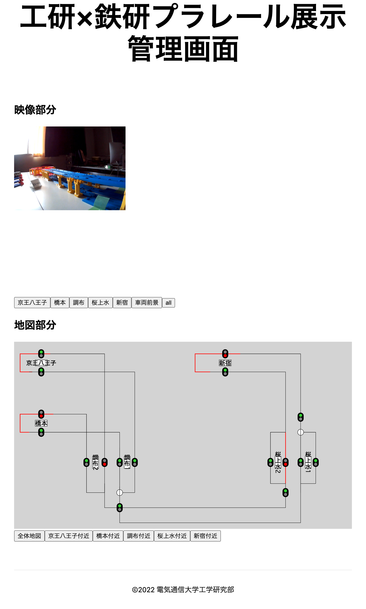
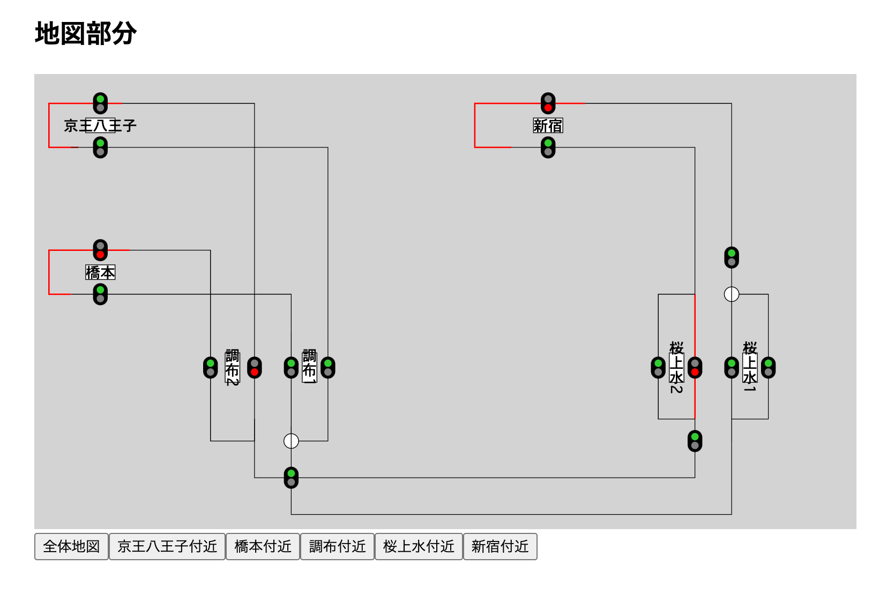
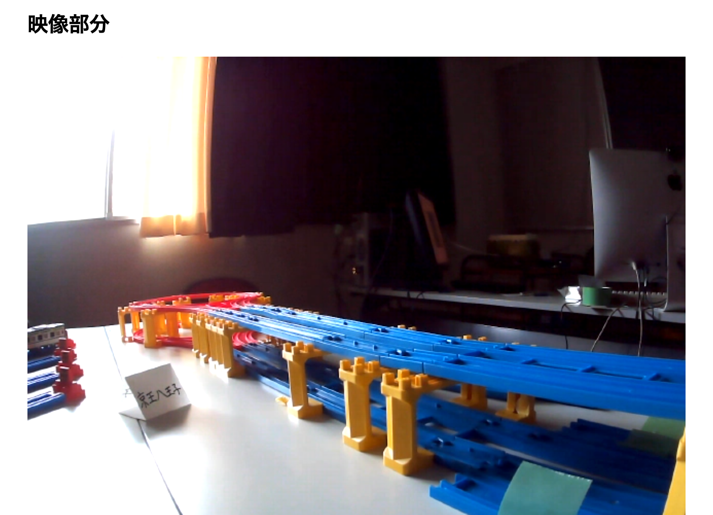

# 管理サイト

昨年は完全オンライン開催だったため、観客側がポイントを遠隔で操作するために操作用のサイトを用意していました。しかし、今年度は対面開催かつ自動運転であるため基本的に来場者がポイントを操作することはありません。そのため、メンテナンスとモニタリング用にポイント・ストップレールの状態の確認と把握、カメラ映像の確認ができるサイトを構築しました。







管理画面の上部には、会場の各駅ごとに設置されたWebカメラの映像が投影されており一括して状態を確認することができます。画面下部では、現在のレールの状態が表示されています。

それぞれの信号がストップレールと対応しており、クリックするとストップレールのON/OFFが切り替わります。また、分岐になっているところをクリックするとポイントが切り替わります。

フロントエンド側とexternalのサーバー側とでWebSocketにて通信を行なっており、リアルタイムで状態の反映が行われるようになっています。

また、路線上で赤色にハイライトされている部分は閉塞区間が閉になっている部分で、その区間内に列車が存在することを示しています。

フロントエンドの実装は、Next.jsで行っています。昨年度のプラレール企画のものをベースとして今年度のレイアウトへの反映や調整を行いました。

画面下部の状態表示の部分はSVGを直接書き換えて実装しており、ReactでSVGをwrapするComponentを作成して下のように全てのパーツを座標指定して配置してあります。（手打ちで全部の座標を打ち込むのはなかなか辛かったのでツールで自動化したいです...）

```jsx
<Rail
  // hachioji_b2
  positions={[
    { x: 120, y: 40 },
    { x: 300, y: 40 },
    { x: 300, y: 500 },
  ]}
  trains={[]}
  isClosed={blockState["hachioji_b2"]}
/>
```