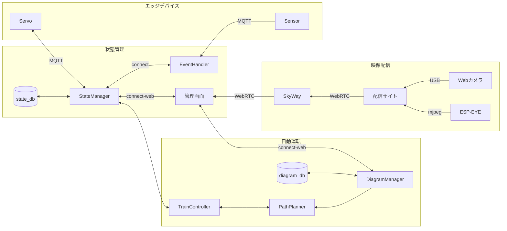

# アーキテクチャ

2023.07.09時点での最新版のアーキテクチャ

## 自動運転
昨年度は実装できなかった部分であるので、1から実装をする必要がある。
アルゴリズムの実装に関しては既に #7 にて議論している。路線の状態をグラフとして管理をする。
アルゴリズムにデータを渡すために色々をしなくてはいけないので、その部分に関しては別途実装する。

## 管理サイト
基本的にやりたいこととしては去年のサイトと同じだが、今回は状態を同期するためのプロトコルとしてconnect-webを採用したい。また、プラレールのレイアウトが微妙に変化することが予想されるのでフロントエンドの調整（SVG手打ち芸）が必要だが、可能ならこの部分を簡単にできるとなおよい。

## 状態管理
これまでとは異なるアーキテクチャで、列車の状態管理をモダンなIoTのアーキテクチャに近づけていきたい。
AWS IoTやAzureなどで利用されているアーキテクチャを模倣する感じで、MQTTでエッジの端末と通信してIOの状態の対応付けをバックエンド側で行うようにする。この部分は正直なところ、MongooseOSなどの既存の仕組みがあるが余裕があれば独自実装したい。
これまでは、KVSで管理していたがPodが死ぬと状態が失われるためアーキテクチャとしてはあまり良くない。
今回はアクセス頻度などを考慮して、MongoDBなどのNoSQLなDBで状態管理を行いたい。

## 列車検知
これまでのホールセンサーやCdSでは読み飛ばしが多くあった。今回はそうしたデータの読み飛ばしをなくすために、マイクロスイッチを用いた列車の通過検知と、列車が駅に停車した際にNFCタグを用いて列車を識別するような仕組みを実装したい。
基本手にはハードウェア側で大規模な処理をするわけではなく、イベントをhttp経由で通知してくれれば良い。（MQTTを採用するメリットは薄いような気もするがプロトコルの検討は必要かも）

## ポイント・ストップレール制御
昨年度と同様にESP32にサーボモータを接続して制御を行うことを検討している。
昨年度からの違いとして、MQTTでブローカーと接続してあげることで現地会場でのサーバー構築作業がなくなるので良さそうかなと思っている。httpよりも薄い感じのプロトコルらしく、普通にESPで問題なく動きそう。
ベースとなるコードはあるものの、実装が大きく変わるのでソースコードの変更は必要。

## カメラ配信
昨年度と同様にしてSkyWayを用いた映像中継を検討している。
車載カメラにはESP-EYEを採用してmjpegなどで受け取った映像を配信用PCからSkyWayに流すことを検討。
旧SkyWayがサービス終了するらしいので実装の変更は必要かもしれない。