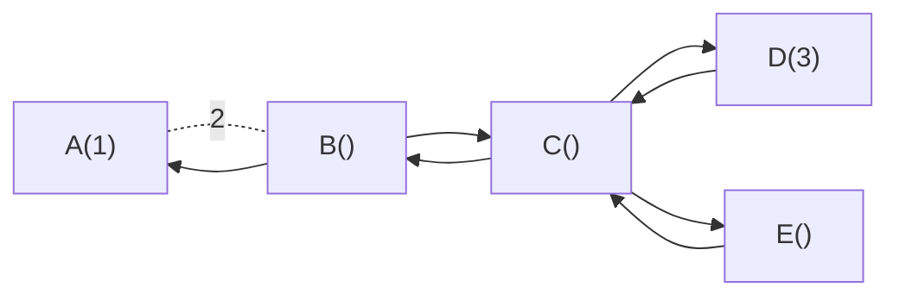
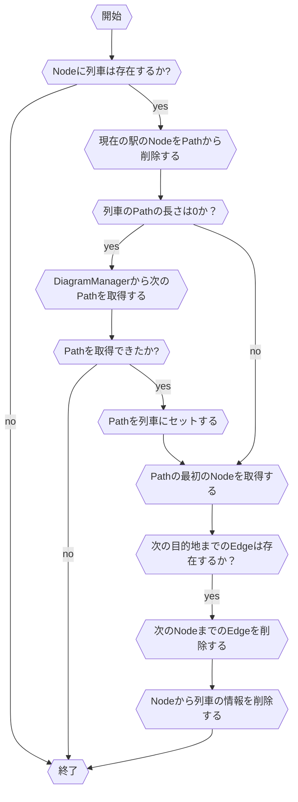
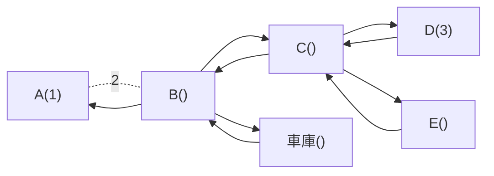

# 自動運転アルゴリズム

列車は以下のようなアルゴリズムに沿って自動運転を行う。

# 概要

全ての列車の位置と閉塞は以下のようなグラフによって管理される。

それぞれのノードが駅，エッジが閉塞を表している。

なお，これ以外に列車は以下のような状態を持つ。
- 列車の位置
- 列車のPriority(列車の種別のようなもの)
- パス(列車が通るべき経路でノードのリスト)

Priorityは0から始まる整数で，値が小さいほど優先度が高い。

## PathPlanner

ある列車の現在の位置と目的地を受け取り，その列車が目的地に到達するためのPathを返す。
PathPlannerはDFSによってグラフを探索して，目的地に到達するまでに通る全てのノードのリスト(Path)を返す。

## TrainController

グラフ上の各ノード対して以下の処理を行う。

なお，この処理はPriorityが高い順番に行う。

それぞれの操作と条件について説明する。

### Nodeへの列車存在確認  

列車が存在しないNodeに対しては処理をする必要がないので，呼び出された時点で終了する。この処理を実現するために，Nodeは停車している列車のIDを持っている。

### Path
列車には列車が通るべき経路(パス)が設定されている。列車があるノードに停車した際には，現在停車しているノードをパスから削除して次に停車すべきノードをパスから取得する。
列車には列車が通るべき経路(パス)が設定されている。列車があるノードに停車した際には，現在停車しているノードをパスから削除して次に停車すべきノードをパスから取得する。

これを毎回のノードで実施することによって，最終的に列車は目的地に到達することができる。目的地に到達した時点でPathの長さが0となるので，DiagramPlannerへ問い合わせを行う。

### Edge

現在のノードから次のノードまでのEdgeは1意に定まる。列車はこのEdgeを通らないと次のノードに到達することができないため，駅から発車するためにはこのEdgeが存在する必要がある。

Edgeが存在して，列車が発車しようとする際にEdgeを削除するが，この操作には以下の特例がある。
**Priorityが0の列車はさらに次のノードへのエッジも消す。つまり2つのエッジを削除する**

ただしこの操作を行うには以下の条件がある。

- 中間の駅のCapasityが1より大きいこと

この条件を満たさない場合は，通常通り1つのエッジを削除する。
## DiagramManager

列車の目的地を管理するサービス。
それぞれの列車の目的地を状態として管理しており，TrainManagerからの要求に応じて目的地とPriorityを返す。

それぞれの列車に設定されているPriorityと目的地は管理画面から設定できる。また，それぞれの目的地とPriorityは優先順位付きのQueで管理されている。

基本的には折り返しが可能な2区間での往復運転を行うように設定されることを想定している。ただし，物理的な制約として折り返しができるのは終点のみである。

## 車庫に関して

車庫は1つのノードとして扱われる。具体的には以下のようなグラフになる。

列車を車庫に入れる場合と車庫から出す場合の挙動に関して説明する。
列車を車庫に入れ得る際には，DiagramManagerで車庫を目的地を設定する。

車庫内のポイントなどは操作せずに，車庫に入るタイミングで閉塞を解除する。

車庫に入った状態の列車は車庫のノードに停車している状態で，車庫から出る際にはDiagramManagerで目的地を設定してあげて，閉塞が閉じられたタイミングでストップレールを解除する。

