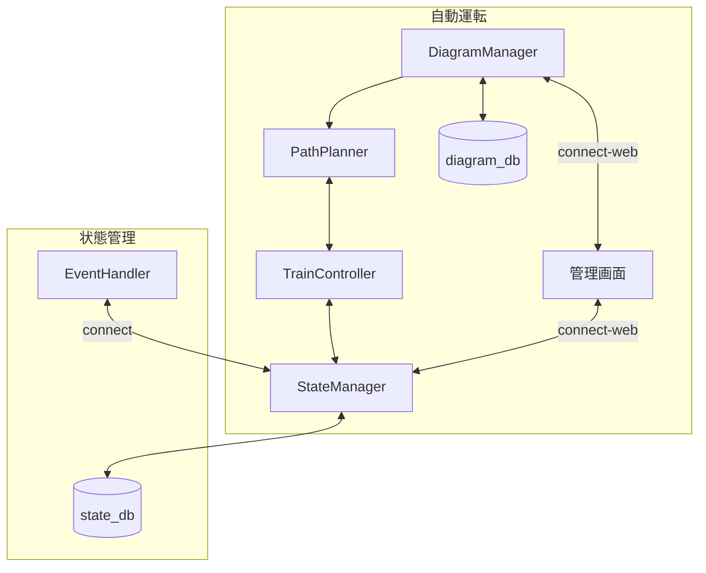

# 自動運転システム

## 用語

プラレール企画で利用する用語の定義を説明する。

ここには2つのレイヤが存在し，列車の走行位置や閉塞の状態をグラフとして管理している`仮想レイヤ`と，実際のプラレール上のストップレールのON/OFFやセンサーの情報を扱う`物理レイヤ`が存在する。

それぞれのレイヤは完全に独立して機能して，`物理レイヤ`の状態は`仮想レイヤ`によって決定され，`仮想レイヤ`の状態の更新は`物理レイヤ`からの情報によって行われる。

### 仮想レイヤの用語

- 閉塞  
現実の鉄道システムからの用語。鉄道の線路を区切る単位。閉塞内には一つの列車しか存在できない。閉塞内に列車が存在する状態を`閉`，存在しない状態を`開`という。

- 閉塞グラフ  
閉塞の関係を表現した有向グラフ。閉塞をエッジ，駅をノードとして表現する。
閉塞が`閉`となっている区間はエッジが存在せず，閉塞が`開`となっている区間はエッジが存在する。また，各ノードは駅の情報以外にその駅に停車している列車の情報を持つ。  
上り線と下り線は別々のノードとして定義して一周するようなグラフであり，あるノードからあるノードへのパスが必ず存在する。

- 列車番号  
それぞれの列車に対して一意に割り当てられる番号。列車の識別に用いる。  
列車IDは各列車に貼り付けられるNFCのIDと一対一対応する。

- 駅のCapacity  
駅に停車できる列車の数を示す。駅に存在するプラットフォームの数と一致する。

### 物理レイヤの用語

- 構内閉塞  
駅に2つ以上のプラットフォームが存在する場合，その駅の閉塞は構内閉塞となる。構内閉塞は駅のCapacityと一致する。なお，構内閉塞は閉塞グラフには含まれない。

- ストップレール  
プラレールにおいて列車を停止させるために利用する特殊なレール。ストップレールのON/OFFを切り替えることで列車を停止させることができる。

- NFCタグ  
プラレールの車両に貼り付けるIDタグ。それぞれのタグには8byte?のIDが割り振られており，このIDと列車の番号の対応付けを行うことで列車の識別を行う。

- NFCリーダー  
プラレールにおいてNFCタグのIDを読み取るために利用するリーダー。それぞれのストップレールの下に設置しており，列車が停止したときにNFCタグのIDを読み取ることができる。

- 通過検知センサー  
プラレールにおいて列車の通過を検知するために利用するセンサー。センサーのON/OFFを切り替えることで列車の通過を検知することができる。物理的にはマイクロスイッチを用いる。

- ESP32  
サーボモータの制御やNFCリーダー，通過検知センサーの制御を行うために利用するマイコン。Wi-Fiを用いて通信を行う。

- サーボモータ  
プラレールのストップレールを制御するために利用するモータ。指示をした角度へ回転する。

## それぞれのサービスの機能
### StateManager

現在の状態を管理するためのサービス。状態をデータベース上に保存して，他のサービスや管理画面からの要求に応じて状態の更新と取得を行う。  
物理レイヤの状態と仮想レイヤの2つの状態を管理する。
### DiagramManager

列車の目的地を決定するサービス。列車ごとに運行情報を管理して，TrainControllerからの要求に応じて目的地を返す。

### PathPlanner

列車の経路を計算するサービス。経路情報のグラフを元にして，DFSによって現在の列車の位置から目的地までの経路を算出して返す。
### TrainController

列車の運行を管理するためのサービス。列車の運行を管理するために必要な情報をStateMangerから取得して，PathPlannerによって計算された経路を元にして列車の運行を制御する。

### EventHandler

列車が通過した場合と停車中の列車からNFCタグのIDを読み取った情報をMQTTを通して受け取り，その情報を元にしてStateManagerに対して状態の更新を要求する。

## 管理画面

現在の状態を確認するための管理画面。StateMangerから状態を取得して表示する。  
また，DiagramManagerに対して運行情報の更新を要求することができる。