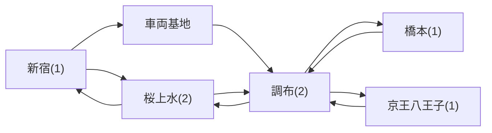
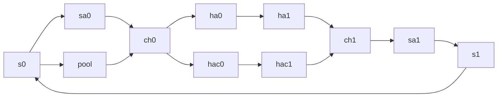

# レイアウト

2023.07.11現在のレイアウト案は以下の通りです。

```mermaid
flowchart LR
  shinjyuku["新宿(1)"]
  sakurajosui["桜上水(2)"]
  syako["車両基地"]
  chofu["調布(2)"]
  hashimoto["橋本(1)"]
  hachioji["京王八王子(1)"]
  syako --> chofu
  shinjyuku --> sakurajosui
  sakurajosui --> shinjyuku
  sakurajosui --> chofu
  chofu --> sakurajosui
  chofu --> hashimoto
  hashimoto --> chofu
  chofu --> hachioji
  hachioji --> chofu
  shinjyuku --> syako
```

```mermaid
flowchart LR
  s0 --> sa0
  sa0 --> ch0
  ch0 --> ha0
  ha0 --> ha1
  ha1 --> ch1
  ch1 --> sa1
  sa1 --> s1
  s1 --> s0
  ch0 --> hac0
  hac0 --> hac1
  hac1 --> ch1
  s0 --> pool
  pool --> ch0 
```