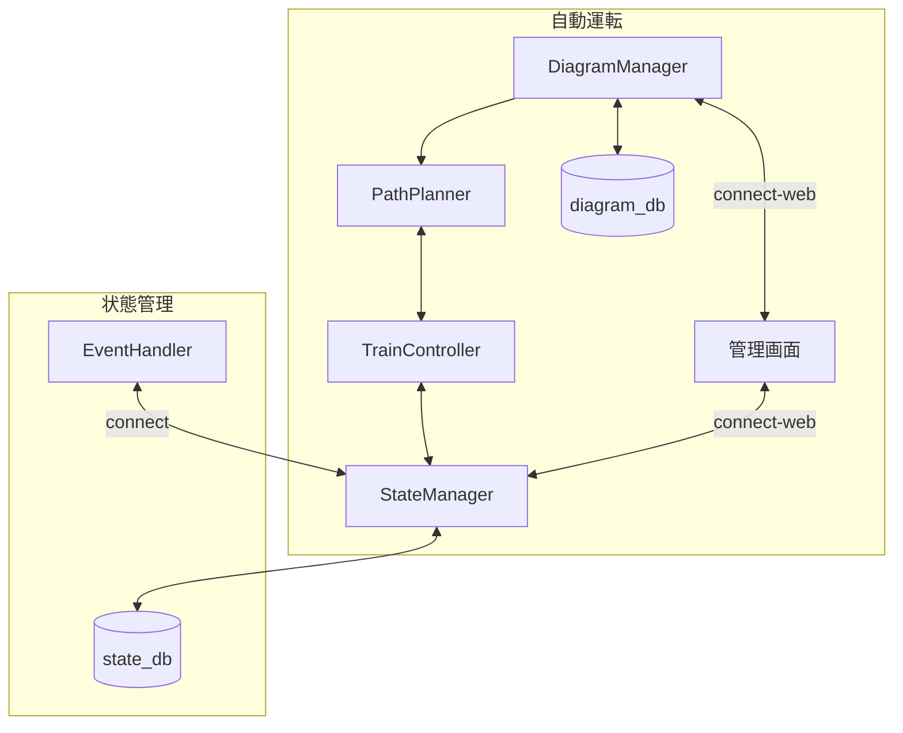

# 自動運転システム

## 用語

プラレール企画で利用する用語を定義する。

ここには2つのレイヤが存在し，列車の走行位置や閉塞の状態をグラフとして管理している`仮想レイヤ`と，実際のプラレール上のストップレールのON/OFFやセンサーの情報を扱う`物理レイヤ`が存在する。

それぞれのレイヤは完全に独立して機能して，`物理レイヤ`の状態は`仮想レイヤ`によって決定され，`仮想レイヤ`の状態の更新は`物理レイヤ`からの情報によって行われる。

### 仮想レイヤの用語

- 閉塞  
現実の鉄道システムからの用語。鉄道の線路を区切る単位。閉塞内には一つの列車しか存在できない。閉塞内に列車が存在する状態を`閉`，存在しない状態を`開`という。

- 閉塞グラフ  
閉塞の関係を表現した有向グラフ。閉塞をエッジ，駅をノードとして表現する。
閉塞が`閉`となっている区間はエッジが存在せず，閉塞が`開`となっている区間はエッジが存在する。また，各ノードは駅の情報以外にその駅に停車している列車の情報を持つ。  
また，上り線と下り線は別々のノードとして定義して一周するようなグラフであり，あるノードからあるノードへのパスが必ず存在する。

- 駅  
閉塞グラフでのノードと一致する。なお，上り線と下り線はそれぞれ別の駅として扱う。

- 列車番号  
それぞれの列車の対して一意に割り当てられる番号。列車の識別に用いる。  
列車IDは各列車に貼り付けられるNFCのIDと一対一対応する。

- 駅のCapacity  
駅に停車できる列車の数を示す。駅に存在するプラットフォームの数と一致する。

### 物理レイヤの用語

- 構内閉塞  
駅に2つ以上のプラットフォームが存在する場合，その駅の閉塞は構内閉塞となる。構内閉塞は駅のCapacityと一致する。なお，構内閉塞は閉塞グラフには含まれない。

- ストップレール  
プラレールにおいて列車を停止させるために利用する特殊なレール。ストップレールのON/OFFを切り替えることで列車を停止させることができる。

- NFCタグ  
プラレールの車両に貼り付けられているIDタグ。それぞれのタグには8byte?のIDが割り振られており，このIDと列車の番号の対応付けを行うことで列車の識別を行う。

- NFCリーダー  
プラレールにおいてNFCタグのIDを読み取るために利用するリーダー。それぞれのストップレールの下に設置しており，列車が停止したときにNFCタグのIDを読み取ることができる。

- 通過検知センサー  
プラレールにおいて列車の通過を検知するために利用するセンサー。センサーのON/OFFを切り替えることで列車の通過を検知することができる。物理的にはマイクロスイッチを用いる。

## StateManager

全体の列車の状態と閉塞を管理する。

