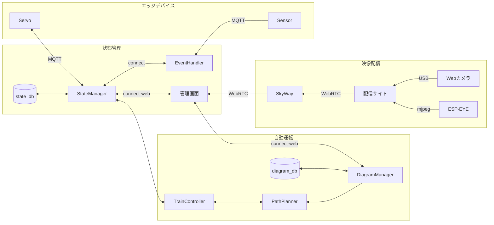

# ソフトウェア

## アーキテクチャ

```mermaid
flowchart RL
subgraph 状態管理
管理画面 <-->|"connect-web"| StateManager

EventHandler <-->|"connect"| StateManager
StateManager <--> DB1[(state_db)]
end
subgraph 自動運転
TrainController <--> StateManager
DiagramManager --> PathPlanner
PathPlanner <--> TrainController
DiagramManager <--> DB2[(diagram_db)]
DiagramManager <-->|"connect-web"| 管理画面
end
subgraph 映像配信
Webカメラ --> |"USB"| 配信サイト
ESP-EYE -->|"mjpeg"| 配信サイト
配信サイト -->|"WebRTC"| SkyWay
SkyWay -->|"WebRTC"| 管理画面
end
subgraph エッジデバイス
StateManager <-->|"MQTT"| Servo
Sensor -->|"MQTT"| EventHandler
end
```